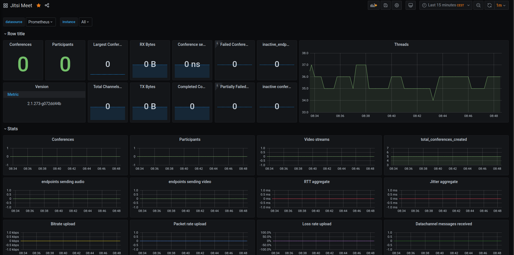

# jitsi2prometheus

This repository has been created for jitsi + prometheus docker environments.



* Enable Jitsi Statistics on port 8080 in `jvb/sip-communicator.properties`
  ```bash
  # enable statistics is false by default
  org.jitsi.videobridge.ENABLE_STATISTICS=true

  # add those two values
  org.jitsi.videobridge.rest.private.jetty.port=8080
  org.jitsi.videobridge.rest.private.jetty.host=0.0.0.0
  ```

* `prometheus.yml`
  ```
  - job_name: 'jitsi'
    static_configs:
    - targets: ['jitsi2prometheus:8080']
  ```
